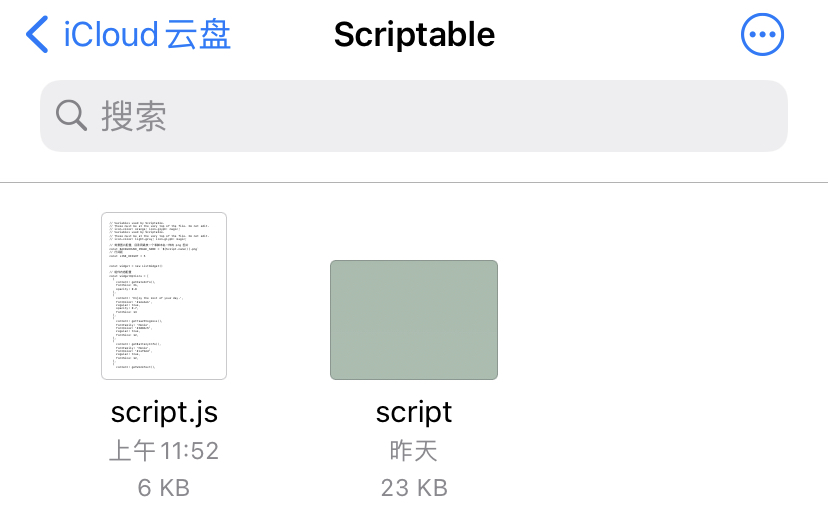
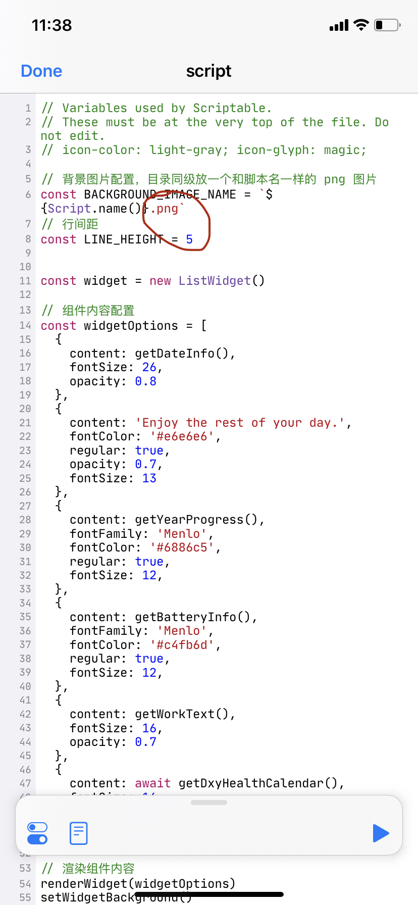

# ios14 scriptable 桌面小组件

## 前置工作

1. 手机更新 `ios 14`
2. 前往应用商店下载 `scriptable`

## 安装脚本

打开 `scriptable`，点击 `scripts to get you started` 这个选项，如下图

选择 `Countdown to Midnight`选项

接下来点弹窗最下面的 `Add to my scripts`，在 `文件` app 内可以看到多了一个文件夹 `Scriptable`

里面也多了一个文件叫 `Countdown to Midnight.js` 的一个文件，然后把这个文件的名字改成 `script`

打开 [这个链接](./script.js)，把里面的内容拷贝到 `icloud` 的文件 `script.js` 里。

回到 `scriptable` app 中，可以看到有了一个新的选项，名字和我们刚才改的名字是一样的。

回到桌面，添加小组件，选择 `Scriptable`，中等组件大小。会在桌面显示一个空的小组件，点击这个组件，在弹窗里按图选择。

然后就可以看到桌面上出现一个白色背景的小组件了。接下来只要设置背景就行。

## 背景图设置

背景图只要把一个 `script.png` 名字的图片放到和 `script.js` 同级目录即可。

如果图片的后缀不是 `.png` 的话，只需编辑 `script.js`，把里面的后缀改成你自己图片格式。

对于 `透明背景`，其实是设置了和你用的壁纸在这一块一样的一张图，可以自己裁剪，或者根据即友的教程自行处理 [okjike.com](https://web.okjike.com/originalPost/5f7122dd2161af001843e7c9)

